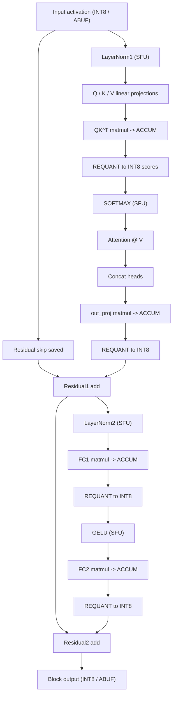
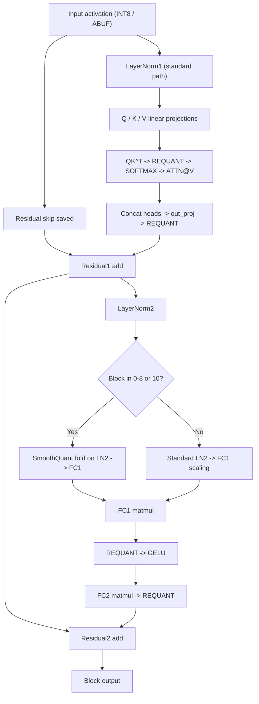
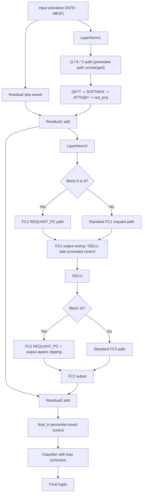

# Block Quantization Flows — 2026-04-08

## Scope

This note replaces the old single-flow mental model with three current views:

1. baseline transformer-block quantization flow
2. current promoted frozen-local flow
3. current promoted ImageNet class-0 flow

These diagrams are intended to reflect the **actual promoted software paths**
as of 2026-04-08. They are not trace dumps or per-image execution records.

## 1. Baseline Block Flow

This is the default conceptual quantized block path:

### Notes

- Matmuls consume `INT8` and accumulate in `INT32`.
- The standard nonlinear path stores `INT8` inputs and outputs.
- Residual adds happen in the quantized domain unless a selective experiment
  changes that path.

## 2. Promoted Frozen-Local Flow

Current promoted frozen-local winner:

- preset: `current_best_sq_ln2_fc1_b0_8_10`
- main change: `SmoothQuant` on `LN2 -> FC1`
- blocks affected: `0,1,2,3,4,5,6,7,8,10`

Diagram:

### Notes

- This winner does **not** depend on `DEQUANT_ADD`, fused attention, or
  `GELU-from-ACCUM`.
- The main win is upstream of `GELU`: reducing LN2-to-FC1 mismatch in selected
  blocks.
- Late attention, especially block 11, remained the dominant residual loss
  source even after this improvement.

## 3. Promoted ImageNet Class-0 Flow

Current promoted ImageNet class-0 golden-model winner:

- base preset: `imagenet_class0_current_best_ptq`
- inherited late-MLP stack:
  - `FC1 REQUANT_PC` on blocks `8,9`
  - FC1-side late tuning from the promoted PTQ control
  - `final_ln:99.8`
  - `block9_ln2:99.0`
- final winning additions:
  - `FC2 REQUANT_PC` on `block10`
  - output-aware clipping on `FC2 block10`
  - classifier bias correction

Diagram:

### Notes

- The promoted ImageNet-class path is still mostly a **late-MLP** win, not an
  attention-path win.
- Runtime twin-uniform softmax / GELU experiments were implemented in the
  simulator, but they ended up aggregate-neutral and are **not** part of the
  promoted flow.
- `FC2 block10` was the last untested late-MLP lane that produced a clean
  improvement in mean, `p10`, and minimum while preserving `95%` top-1.

## What Is Not In The Promoted Flows

The following were implemented and tested, but are not part of the promoted
baseline diagrams above:

- `GELU-from-ACCUM`
- broad fused `SOFTMAX_ATTNV`
- `DEQUANT_ADD` as a promoted accuracy path
- PTQ4ViT-style twin-uniform as a promoted golden-model path
- extra `block10_ln2` percentile tuning on top of the FC2 winner
- `late_fc2` bias correction

## Reading Guide

Use these three diagrams as:

- baseline architecture reference
- frozen-local promoted compiler flow
- ImageNet-class promoted compiler flow

Do **not** treat them as per-image dynamic traces. For measured results and
experiment history, use:

- [quantization_experiments_2026-04-01.md](/Users/sayat/Documents/GitHub/transformer_accelerator/software/docs/quantization_experiments_2026-04-01.md)
- [diagnostics_rerun_2026-03-29.md](/Users/sayat/Documents/GitHub/transformer_accelerator/software/docs/diagnostics_rerun_2026-03-29.md)
